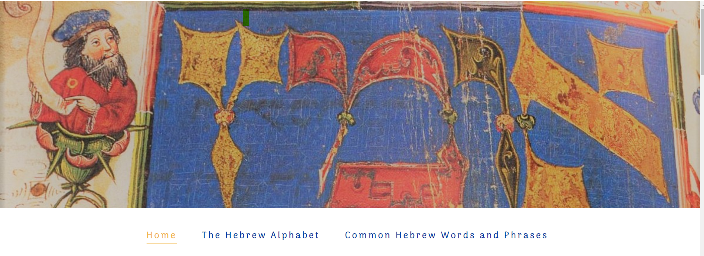

# Hebrew Language

The goal of this website is to provide people information about the Hebrew language, alphabet, and most common Hebrew words. It is mainly aimed at people who are generally interested in learning about the Hebrew language and culture. Using beautiful pictures from Hebrew illuminated manuscripts, it also hopes to stir people's curiosity about Jewish culture and civilisation. 

You can view the live website [here](https://shoshie-coding.github.io/hebrew-language/). 

## Features
### Existing Features
- The Header image and Navigation Bar 
The Header image provides visual stimulation and sets the color theme for the whole website. 
The Navigation Bar is featured on all three pages, it includes links to Home page, Hebrew language page and the Common Hebrew Phrases page. It is fully responsive and allows users to navigate seamlessly between pages.

- The main heading and image introduces the user to the Hebrew language and the theme of the website. 

## Design

### Color Theme and imagery
[Adobe Color](https://color.adobe.com/create/color-wheel) was used to extract the main three colors of the website: blue, cream and dark brown. The colors were extracted from imagages on my website. These are old Hebrew manuscripts and Hebrew illuminated manuscripts that show the beauty of the Hebrew alphabet and Jewish art. 

### Typography
For the main text, 'Montserrat' font is used with a fall-back on sans-serif. For headings, navigation bar and footer, 'Arima Madurai' font is used with a fallback on cursive.

## Deployment 
### GitHub Pages
The project was deployed to GitHub Pages using the following steps:
1. Go to GitHub and locate the repository to be deployed [GitHub Repository](https://github.com/Shoshie-coding/project-1)
2. On the top right-hand side - click Settings
3. Scroll down until you locate the Pages tab on the left-hand side navigation menu. 
4. Under Source - click on the drop-down called None and select Main and leave the /(root) option as it is. 
5. Click Save 
6.  The Page refreshes itself - message " Your site is ready to be published at https://shoshie-coding.github.io/project-1/. 
7. Refresh page - notice message -  Your site is published at https://shoshie-coding.github.io/project-1/. 

### Local Clone

## Credits 

### Content 
The following resources were used as sources of information and inspiration for the content on my website:

- [Hebrew-English and English-Hebrew dictionary](https://www.morfix.co.il/en/) - this online dictionary was used mainly to translate words and to add them in Hebrew letters. 

- [Hebrew Language - Wikipedia article](https://en.wikipedia.org/wiki/Hebrew_language) - this article contains info on the Hebrew language and history. 

- [Encyclopaedia Britannica]( https://www.britannica.com/topic/Hebrew-language) - this offers a short intro to the Hebrew language.

- [The Times of Israel article](https://blogs.timesofisrael.com/basic-hebrew-phrases-and-slang-you-should-know-in-israel/) with info on Israeli slang words. 

### Media
Some pictures on my website are not from royalty free websites. This is a student website, my project is for educational purposes only. If I decide to make this a commercial website, I will change the pictures. The pictures are listed below in order of appearance on the website.

- [Header image on Home page - free to download from Unspash](https://unsplash.com/photos/xUXGHzhIbN4)

- Image of a Dead Sea Scrolls manuscript - [Lingualift](https://www.lingualift.com/blog/how-to-learn-hebrew-alphabet/) credited to [Facsimile finder](https://www.facsimilefinder.com/)

- Image of a medieval decorated text text credited to  [Lingualift](https://www.lingualift.com/blog/how-to-learn-hebrew-alphabet/) - [The Jewish Museum] (https://thejewishmuseum.org/)
- [Picture of Hebrew vowels](https://omniglot.com/writing/hebrew.htm) 

- [Yeshiva University Museum](https://www.yumuseum.org/programs/2019/09/08/art-workshop-new-years-cards-in-the-style-of-illuminated-hebrew-manuscripts) - picture with the word 'Shalom' in Hebrew. 

- Picture of a Hebrew text - [Unsplash](https://unsplash.com/photos/eQ2Z9ay9Wws)

### Code
Inspiration for the table on the Alphabet page came from [W3 Schools article](https://www.w3schools.com/css/css_table_style.asp)

[W3 Schools article on pseudo-classes and link styling](https://www.w3schools.com/css/css_pseudo_classes.asp).

Fonts were taken from [Google Fonts](https://fonts.google.com/)

I used [Adobe color](https://color.adobe.com/mythemes) to extract the colors used on the website. 

## Testing
### Code Validation

### Responsiveness Test
- I used media queries to make my website responsive

### Browser compatibility
I tested my website on various browsers and screen sizes. The website works well and is responsive as expected and designed everywhere I tested. 

#### Browsers
- Chrome
- Microsoft Edge 
- Internet Explorer
- Mozilla Firefox

#### Devices:
- Desktop
- Laptop
- iPhone 8
- Samsung S10 Plus
- Huawei P30

### Bugs 

