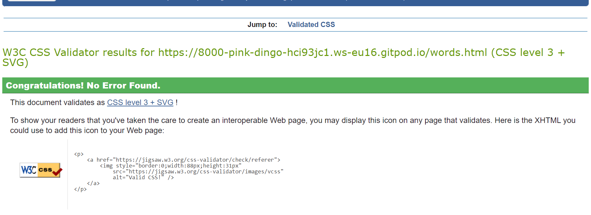

# **Hebrew Language**

The goal of this website is to provide people information about the Hebrew language, alphabet, and most common Hebrew words. It is mainly aimed at people who are generally interested in learning about the Hebrew language and culture. Using beautiful pictures from Hebrew manuscripts, it also hopes to stir people's curiosity about Jewish culture and civilisation. 

You can view the live website [here](https://shoshie-coding.github.io/hebrew-language/).

 

## **Features**
### **Existing Features**
- **Header image and Navigation Bar** 
The header image provides visual stimulation and sets the color theme for the whole website. This theme is present on all the pages of the website providing consistency for the users. 
The Navigation Bar is featured on all three pages, it includes links to Home page, Hebrew language page and the Common Hebrew Phrases page. It is fully responsive and allows users to navigate seamlessly between pages.
 

- The **main heading and image** introduce the user to the Hebrew language and the theme of the website. 


- The **main points menu** on the Home and Alphabet pages provides a summary of what is discussed on each of these pages and links to those sections.


- The **alphabet table** that lists all the letters of the Hebrew alphabet with their pronunciation which is responsive and easy to read on small screen sizes. 
 

- The **listening and speaking** practice section on the Alphabet page with links to YouTube videos. 


- The **two images sorrounded by content** on the Common Hebrew Phrases page


- The **footer** that is visible on all pagesa and contains links to social media accounts and copyrights info. 


### **Features left to implement**
- Contact page - we want to implement a contact page for users to contact the page for info on Hebrew language and civilization and for Hebrew classes we are organising regularly.
- Resource page with info on audio and video resources people can use to learn Hebrew language and articles.


## Design
- ### **Color Theme and imagery**
[Adobe Color](https://color.adobe.com/create/color-wheel) was used to extract the main three colors of the website: blue, cream and dark brown. The colors were extracted using images on the website. These are old Hebrew manuscripts and Hebrew illuminated manuscripts that show the beauty of the Hebrew alphabet and Jewish art. 

- ### **Typography**
For the main text, 'Montserrat' font is used with a fall-back on sans-serif. For headings, navigation bar and footer, 'Arima Madurai' font is used with a fallback on cursive.

## **Testing**
### **Validator Testing**

#### HTML code validator 
The website passed all code validations


#### CSS code validator




#### Lighthouse report
The website passed the Lighthouse report

### **Responsiveness Test**
- I used media queries to make my website responsive. 

### **Browser compatibility**
- I tested my website on various browsers and screen sizes as shown below. The website works well and is responsive on monitors and laptop screens. 
- I also tested the website using Chrome dev tools device toolbar, by adjusting the size of the window and by selecting the pre-set devices available there. 
- All links are clickable and open in a new tab. 
- Pictures resize accurately and are clear, nor blurry or pixelated. 

#### Browsers
- Chrome
- Microsoft Edge 
- Internet Explorer
- Mozilla Firefox
- Safari

#### Devices:
- Desktop
- Laptop
- Samsung S10 Plus
- Huawei P30
- iPhone 8
- iPhone XS

### **Bugs** 
#### **Known Bug - header image on home page not displayed on tablet**
- I manually tested this on a Lenovo tablet and a Samsung one, the header image on the Home page is not displaying. I cannot see this issue in Chrome in Dev tools, therefore at the moment I don't have a way to find a fix for this. 

#### **Hebrew letters issue**
- When trying to validate my HTML code with W3C, Hebrew letters were not recognized as I was using vowels with them.
 - I added attribute lang="he to the heading as per this [W3.org article](https://www.w3.org/International/questions/qa-html-language-declarations)

- It didn't help fix the issue. I removed the vowels and it worked. There are limitations with adding several languages in the same code, there are a few options available out there but I didn't find viable solutions. 

#### **Browser is adding white margins on the sides** 
- This is a known bug for many browsers
- I searched online and found this [Stack Overflow article](https://stackoverflow.com/questions/4612307/website-has-strange-whitespace-on-right-side-of-the-page-when-the-browser-is-res) that is taken from [Wernull blog](https://blog.wernull.com/2013/04/debug-ghost-css-elements-causing-unwanted-scrolling/)

- I applied the troubleshoorung steps:
  1. Implement the code at the end of the CSS file
  ```css
  * {
    background: #000 !important;
    color: #0f0 !important;
    outline: solid #f00 1px !important;
  }
  ```
  2. Go to the website and refresh.
  3. Notice the white spaces on the margin - open inspect.
  4. The rule set by user agent style sheet sets margin to 8px.
  5. Notice I cannot test and change the margin on dev tools.
  6. Search online and find out that this refers to the default styles that browsers apply to web pages.
  7. Go to CSS files and remove code from step 1.
  8. Add margin and set it to 0.
  9. Refresh website and notice it fixed the issue - margin is not showing anymore. 
#### **Hover border**
  I removed the border for hover on screens smaller than 535px because it didn't look good on small screens.  

## **Deployment**
### GitHub Pages
The project was deployed to GitHub Pages using the following steps:
1. Go to GitHub and locate the repository to be deployed [GitHub Repository](https://github.com/Shoshie-coding/project-1)
2. On the top right-hand side - click Settings
3. Scroll down until you locate the Pages tab on the left-hand side navigation menu. 
4. Under Source - click on the drop-down called None and select Main and leave the /(root) option as it is. 
5. Click Save 
6.  The Page refreshes itself - message " Your site is ready to be published at https://shoshie-coding.github.io/project-1/. 
7. Refresh page - notice message -  Your site is published at https://shoshie-coding.github.io/project-1/. 

### Clone a repository using these steps:
1. On GitHub, navigate to the main page of the repository.

2. Above the list of files, click the Code button.
3. To clone the repository using HTTPS, under "Clone with HTTPS", click the clone symbol. To clone the repository using an SSH key, including a certificate issued by your organization's SSH certificate authority, click Use SSH, then click the clone symbol next to it. To clone a repository using GitHub CLI, click Use GitHub CLI, then click the same clone symbol .
4. Open Git Bash and change the current working directory to the location where you want the cloned directory.

5. Type git clone, and then paste the URL you copied earlier.

6. You will see a message confirmation that the command was successul. 

### **Technologies**
1. [Google Fonts](https://fonts.google.com/) was used to import fonts 'Montserrat'and 'Arima Madurai' that are used throughout the website. 

2. [Adobe color](https://color.adobe.com/mythemes) was used to extract the colors used on the website. 
3. [Git](https://git-scm.com/) was used to used to edit the code on the Gitpod terminal, to commit to Git and Push to GitHub.

4. [GitHub](https://github.com/) is used to store the project code after being pushed from Git. 

## **Credits**

### **Content**
The following resources were used as sources of information and inspiration for the content on my website:

- [Hebrew-English and English-Hebrew dictionary](https://www.morfix.co.il/en/) - this online dictionary was used mainly to translate words and to add them in Hebrew letters. 

- [Hebrew Language - Wikipedia article](https://en.wikipedia.org/wiki/Hebrew_language) - this article contains info on the Hebrew language and history. 

- [Encyclopaedia Britannica](https://www.britannica.com/topic/Hebrew-language) - this offers a short intro to the Hebrew language.

- [The Times of Israel article](https://blogs.timesofisrael.com/basic-hebrew-phrases-and-slang-you-should-know-in-israel/) with info on Israeli slang words. 

### **Media**
Some pictures on my website are not from royalty free websites. This is a student website, my project is for educational purposes only. If I decide to make this a commercial website, I will change the pictures. The pictures are listed below in order of appearance on the website.

- [Header image on Home page - free to download from Unspash](https://unsplash.com/photos/xUXGHzhIbN4)

- Image of a Dead Sea Scrolls manuscript - [Lingualift](https://www.lingualift.com/blog/how-to-learn-hebrew-alphabet/) credited to [Facsimile finder](https://www.facsimilefinder.com/)

- [Lingualift](https://www.lingualift.com/blog/how-to-learn-hebrew-alphabet/) - Image of a medieval decorated text credited to [ [The Jewish Museum] (https://thejewishmuseum.org/)
- [Picture of Hebrew vowels](https://omniglot.com/writing/hebrew.htm) 

- [Yeshiva University Museum](https://www.yumuseum.org/programs/2019/09/08/art-workshop-new-years-cards-in-the-style-of-illuminated-hebrew-manuscripts) - picture with the word 'Shalom' in Hebrew. 

- Picture of a Hebrew text - free download from [Unsplash](https://unsplash.com/photos/eQ2Z9ay9Wws)

### **Code**
- Inspiration for the table on the Alphabet page came from [W3 Schools article](https://www.w3schools.com/css/css_table_style.asp)

- [W3 Schools article on pseudo-classes and link styling](https://www.w3schools.com/css/css_pseudo_classes.asp).

- [Article on how to design tables per per UX design rules](https://www.uxmatters.com/mt/archives/2020/07/designing-mobile-tables.php)

## Acknowledgements
My mentor for good feedback on my project and everyone at Code Institute who provided helpful tips along the way.  


